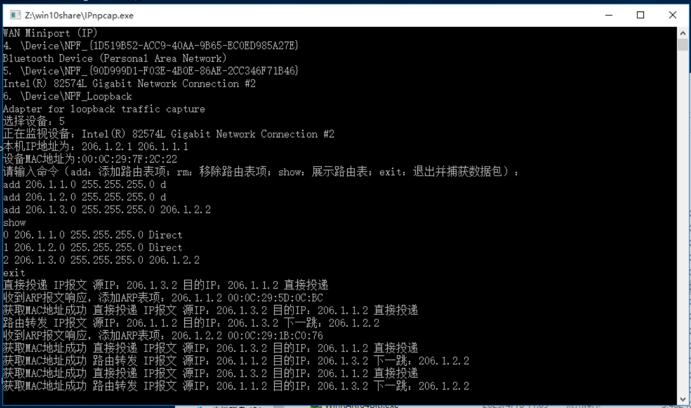
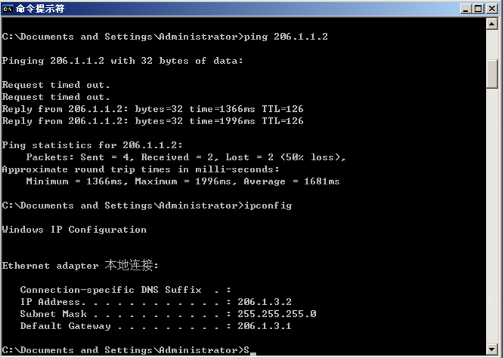
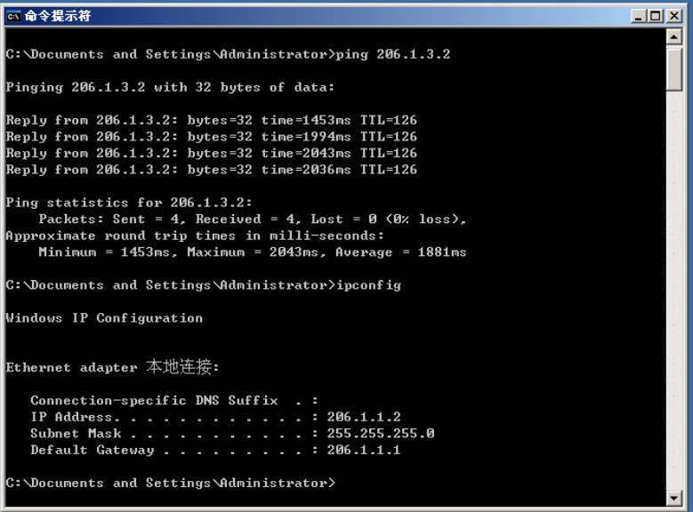
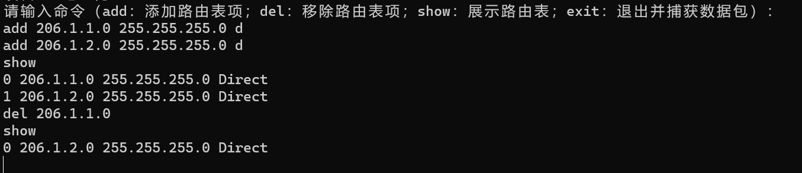

# 实验报告

## 实验要求

实现路由程序，实现IP数据报和ARP数据报的捕获和转发，并能与其他路由器协同工作。

## 设计思路

本次实验主要包括以下模块：

+ 路由表的建立和查找。
+ ARP缓存的建立和查找，过期处理。
+ ARP报文的处理。
+ IP数据报的处理，对于直接投递和转发这两种情况的区别。
+ 本机网卡IP地址和MAC地址的获取。

## 实现方法

### 路由表

路由表中的每一条包含以下字段：

+ 网段。
+ 子网掩码。
+ 下一跳。
+ 是否为直接投递。

```c++
typedef struct RouterTable_t {
	DWORD IP;
	DWORD Mask;
	DWORD Next;
	WORD flag;
} RouterTable_t;
vector<RouterTable_t> routerTable;
```

使用`vector`数据结构管理所有的路由表。

### ARP缓存

ARP缓存中的每一条包含以下字段：

+ 建立时间。
+ 保存时长。
+ IP地址。
+ MAC地址。

```c++
typedef struct ARPTable_t {
	clock_t time;
	int keep;
	DWORD IP;
	BYTE Mac[6];
} ARPTable_t;
vector<ARPTable_t> ARPTable;
```

使用`vector`数据结构管理所有的ARP缓存。

### 路由表的添加

添加路由表需要输入网段、子网掩码和下一跳。如果添加的路由表项为直接投递，则下一跳的位置输入`d`，以此决定路由表项的`flag`：

```c++
string IP, mask, next;
cin >> IP >> mask >> next;
RouterTable_t t;
inet_pton(AF_INET, IP.c_str(), &t.IP);
inet_pton(AF_INET, mask.c_str(), &t.Mask);
if (next == "D" || next == "d")
{
    t.flag = RO_DIRECT;
    t.Next = 0;
}
else
{
    inet_pton(AF_INET, next.c_str(), &t.Next);
    t.flag = RO_STATIC;
}
routerTable.push_back(t);
```

### 路由表的查找

查询路由表的步骤如下：

+ 遍历vector，查找网络和掩码的与是否和网络号一致。
+ 查询到一致的数据后，记录掩码长度，判断和上一次的掩码的大小。如果掩码更长，则保留当前查询项。
+ 遍历结束，返回匹配项。

```c++
RouterTable_t getRouteEntry(DWORD ip)
{
	auto it = routerTable.begin();
	RouterTable_t choose;
	choose.Mask = 0;
	while (it != routerTable.end())
	{
		if ((ip & it->Mask) == (it->IP & it->Mask) && it->Mask >= choose.Mask)
			choose = *it;
		it++;
	}
	return choose;
}
```

### 路由表的删除

删除路由表需要输入删除的网段，查询路由表将匹配项删除即可：

```c++
string delIP;
cin >> delIP;
auto it = routerTable.begin();
for (; it != routerTable.end(); it++)
{
    DWORD ip;
    inet_pton(AF_INET, delIP.c_str(), &ip);
    if (it->IP == ip)
        break;
}
if(it->flag)
routerTable.erase(it);
```

### ARP缓存查找

查询ARP缓存的步骤如下：

+ 遍历ARP缓存，查找IP地址。
+ 如果存在，则判断时间是否过期，，如果没过期则返回true，保存MAC地址。
+ 其余情况返回false。

```c++
bool getMAC(DWORD ip, BYTE MAC[])
{
	auto it = ARPTable.begin();
	for (; it != ARPTable.end(); it++)
	{
		if (it->IP == ip)
		{
			// 判断表项是否有效
			time_t local = clock();
			if (it->time + it->keep > local)
			{
				memcpy(MAC, it->Mac, 6);
				return true;
			}
			else
				break;
		}
	}
	if(it != ARPTable.end())
		ARPTable.erase(it);
	sendARP(adhandle, getSendIP(ip), deviceMAC, ip, nullptr, false);
	return false;
}
```

### 本机MAC地址的获取

构造虚拟主机，发送ARP请求，获取本机的ARP响应。与实验3相同。

### ARP报文的处理

收到ARP报文，需要判断是否为ARP响应，如果是，则读取IP和MAC地址，设置过期时间，写入ARP缓存中：

```c++
ARPFrame_t* ARPFrame = (ARPFrame_t*)packet;
int op = ARPFrame->Operation;
if (op == ntohs(2))
{
    ARPTable_t t;
    t.IP = ARPFrame->SendIP;
    memcpy(t.Mac, ARPFrame->SendHa, 6);
    t.time = clock();
    t.keep = 300000;
    ARPTable.push_back(t);
    char output[INET_ADDRSTRLEN];
    inet_ntop(AF_INET, &t.IP, output, INET_ADDRSTRLEN);
    string MACstr = format("{:02X}:{:02X}:{:02X}:{:02X}:{:02X}:{:02X}", ARPFrame->SendHa[0], ARPFrame->SendHa[1], ARPFrame->SendHa[2], ARPFrame->SendHa[3], ARPFrame->SendHa[4], ARPFrame->SendHa[5]);
    cout << "收到ARP报文响应，添加ARP表项：" << output << " " << MACstr << endl;
    continue;
}
```

### IP数据报的处理

对于IP数据报，需要经过以下步骤：

+ 校验并检查以太帧头部信息中的目的MAC地址是否为本机MAC地址，如果不是，则丢弃。
+ 查询路由表项，如果是直接投递，则应将MAC地址设置为目的MAC地址；如果不是，则应将MAC地址设置为下一跳的MAC地址。
+ 查询MAC地址，如果存在，则填入报文，将TTL减一，重新计算头部检验和，转发数据报；如果不存在，发送ARP请求。

```c++
// IP数据包需要判断捕获长度，并转发
Data_t* IPPacket = (Data_t*)packet;
recvIP = IPPacket->IPHeader.DstIP;
int len = ntohs(IPPacket->IPHeader.TotalLen);
RouterTable_t choose;
choose = getRouteEntry(recvIP);
// 
if (calcCheckSum((uint16_t*)&IPPacket->IPHeader, sizeof(IPHeader_t)) != 0)
{
    cout << "校验错误" << endl;
    continue;
}
IPPacket->IPHeader.Checksum = 0;
IPPacket->IPHeader.TTL -= 1;
IPPacket->IPHeader.Checksum = calcCheckSum((uint16_t*)&IPPacket->IPHeader, sizeof(IPHeader_t));
if (choose.flag == RO_DIRECT)
{
    bool ret = getMAC(IPPacket->IPHeader.DstIP, IPPacket->FrameHeader.DesMAC);
    if(ret)
        pcap_sendpacket(adhandle, (u_char*)packet, sizeof(FrameHeader_t) + len);
    if (ret) cout << "获取MAC地址成功 ";
    cout << "直接投递 ";
}
else if(compMAC(IPPacket->FrameHeader.DesMAC, deviceMAC))
{
    bool ret = getMAC(choose.Next, IPPacket->FrameHeader.DesMAC);
    if(ret)
        pcap_sendpacket(adhandle, (u_char*)packet, sizeof(FrameHeader_t) + len);
    if (ret) cout << "获取MAC地址成功 ";
    cout << "路由转发 ";
}
```

### 其他

为了加快程序执行，我们采取双线程，一个线程负责抓包，将获取的报文加入到消息队列中；另一个线程负责处理从消息队列中取出并处理数据报文。

```c++
thread cap(capData); // 建立子线程
// 主线程处理IP数据包和ARP报文
while (true)
{
	Packet_t* packet;
	{
		lock_guard<mutex> lock(queueMutex);
		if (msgQuene.size() == 0)
			continue;
		packet = msgQuene.front();
		msgQuene.pop();
	}
    // ...
}
```

## 测试方法

添加直接投递和转发的路由表项，在虚拟机上运行，在需要ping的主机上运行wireshark。由于在虚拟机中，四台虚拟机采取桥接网络，在vmware中使用的是相同的网卡，所以可以直接看到所有的转发过程。

查看wireshark是否能识别转发过程中发送的数据报，并且各主机是否能正确响应。

## 实验结果

路由程序运行截图，包括配置路由表项和工作日志：



主机互相ping，均成功：





在开始ping的时候有两次`Request timed out`，对此的解释如下：

+  第一次发送，路由器A收到主机A的消息，查找路由表，得到下一跳。查询ARP缓存，不存在该项，则发送ARP广播，请求路由器B的MAC地址。第一次发送失败。
+ 第二次发送，路由器A收到主机A的消息，转发给路由器B。主机B回应后，查找路由表，发现是直接发送给主机A，查询ARP缓存，不存在该项，则发送ARP广播，请求主机A的MAC地址。第二次发送失败。
+ 第三四次发送，正常转发。
+ 主机B后续ping主机A，由于时间间隔很短，ARP缓存有效，所以可以查找MAC地址并直接转发。

测试删除路由表项：



